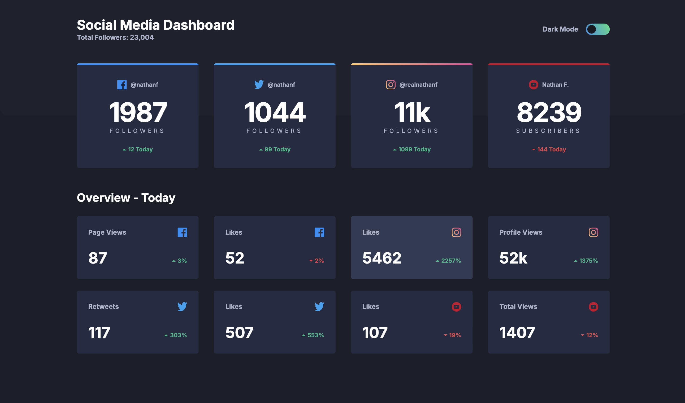
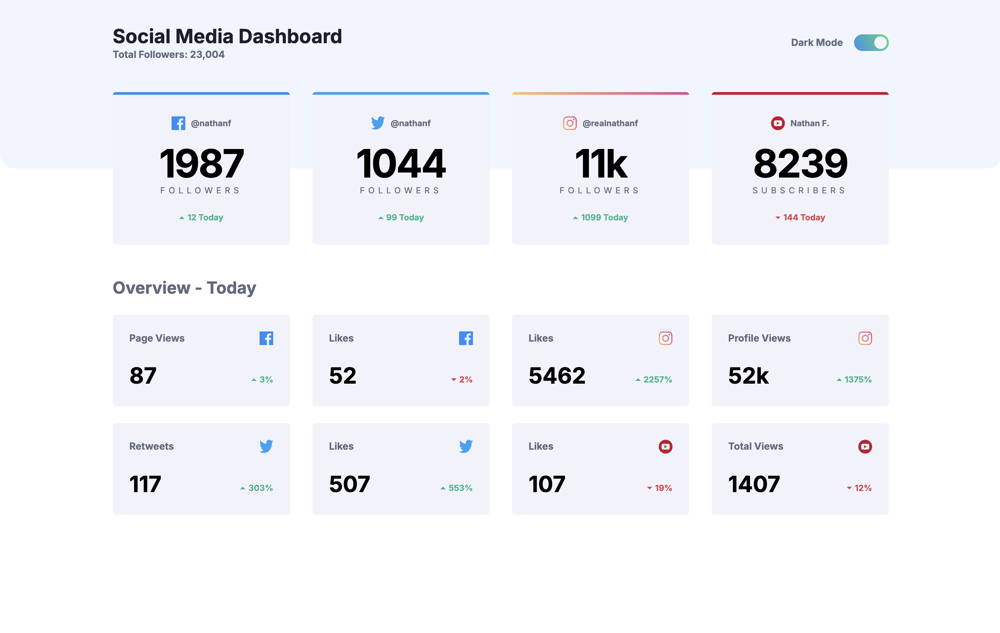

# Social Media Dashboard with Theme Switcher

## Table of contents

- [Overview](#overview)
  - [Screenshot](#screenshot)
  - [Links](#links)
- [My process](#my-process)
  - [Built with](#built-with)
- [Author](#author)

## Overview

### Screenshot

### Links

- Solution URL: [Solution URL](https://github.com/kisu-seo/social_media_dashboard_with_theme_switcher)
- Live Site URL: [Live URL](https://kisu-seo.github.io/social_media_dashboard_with_theme_switcher/)

## My process

### Built with

- **Semantic HTML5 Markup** — Structured with purpose-built tags (`<header>`, `<main>`, `<section>`, `<article>`) to create a meaningful document outline that supports both SEO and screen reader navigation. Avoided generic `
` wrappers where semantic alternatives exist.

- **Web Accessibility (A11y)**
  - Dark mode toggle built with a `<button>` element and `role="switch"`, so screen readers correctly announce it as an on/off switch rather than a generic button.
  - `aria-checked` dynamically updated in JavaScript to stay in sync with the toggle's visual state on every click.
  - `aria-hidden="true"` applied to all decorative platform icon images (Facebook, Twitter, Instagram, YouTube) to prevent redundant announcements by screen readers.
  - `<label for="darkModeToggle">` connected to the toggle button so the "Dark Mode" text label is a clickable tap target on mobile.
  - `<section aria-label="...">` on both card groups to give screen reader users a clear landmark for each content area.

- **Tailwind CSS (CDN + Custom Design Token System)**
  - All brand values are centralized inside `tailwind.config` (injected via a `<script>` tag), defining a complete set of **custom color tokens** (`gray-950`, `navy-900`, `navy-50`, `blue-facebook`, `blue-twitter`, `red-youtube`, `green-positive`, `red-negative`, etc.), **typography presets** (`preset-1`–`preset-6` with size, line-height, and letter-spacing), and **spacing tokens** (`spacing-100` through `spacing-800`).
  - **Mobile-First Responsive Design**: Base styles target mobile (375px); `md:` (768px+) and `lg:` (1024px+) breakpoints progressively enhance the layout — from stacked single-column to a 4-column grid (`lg:grid-cols-4`) — matching all three breakpoints specified in the style guide.
  - **Dark Mode via Class Strategy**: `darkMode: 'class'` is set in `tailwind.config`, meaning all `dark:` variants activate only when the `<html>` element carries the `dark` class. This gives JavaScript full, explicit control over the theme state.
  - **Scoped Hover States**: Card hover effects are prefixed with `lg:hover:` so they only fire on pointer devices (desktop), preventing unintended highlight flashes on touch screens.
  - **`transition-colors duration-300`**: Applied globally to backgrounds and text colors so every light ↔ dark theme switch animates smoothly rather than snapping.

- **CSS (Custom Component Styles)**
  - **Toggle Switch**: `.toggle-track` and `.toggle-thumb` are handcrafted in plain CSS because a sliding pill-shaped toggle with an animated thumb cannot be replicated with Tailwind utility classes alone. The thumb position is controlled by `transform: translateX()` and animated with `transition`.
  - **Instagram Gradient Border**: The three-color gradient top border on the Instagram card is drawn by a `.instagram-border::before` CSS pseudo-element — a technique that adds a decorative element without touching the HTML markup.
  - **Dark Mode Toggle Gradient**: When `dark` class is present, `.toggle-track` receives a `linear-gradient(64deg, #388FE7, #40DB82)` background matching the Gradient 2 spec in the style guide.

- **Vanilla JavaScript (ES6+ / Data-Driven Rendering)**
  - **DRY Architecture**: All 12 cards (4 main + 8 overview) are defined as plain data objects in two arrays (`mainCardsData`, `overviewCardsData`). A single `renderCards()` engine function reads any array and writes the DOM — adding a new card requires only a new data entry, not any HTML edit.
  - **IIFE for Theme Initialization**: An Immediately Invoked Function Expression runs at parse time to read `localStorage` and restore the saved theme before the first paint, preventing a flash of the wrong theme on page load.
  - **`classList.toggle()` Dark Mode Switch**: One call toggles the `dark` class on `<html>` and returns the new boolean state, which is then used to sync `aria-checked` and persist the preference to `localStorage` — three side effects from a single expression.
  - **`Array.prototype.reduce` for Single Reflow**: Instead of appending to `innerHTML` inside a `forEach` loop (which triggers a browser reflow on every iteration), `reduce` concatenates all card HTML strings into one and assigns them to `innerHTML` exactly once — minimizing layout recalculation.
  - **`<script defer>` for Safe DOM Access**: The `defer` attribute on the script tag guarantees that the full HTML is parsed before any JavaScript runs, so `document.getElementById()` calls always find their targets without needing a `DOMContentLoaded` wrapper.
  - **JSDoc Documentation**: All functions and data arrays are annotated with `@typedef`, `@property`, `@param`, and `@returns` tags, turning the data-layer types into self-documenting contracts that editors can use for autocompletion and type checking.

## Author

- Website - [Kisu Seo](https://github.com/kisu-seo)
- Frontend Mentor - [@kisu-seo](https://www.frontendmentor.io/profile/kisu-seo)
